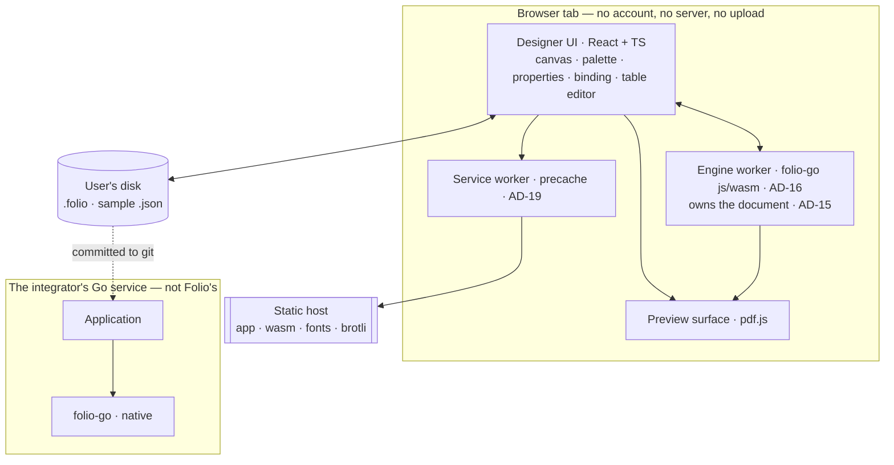

# Architecture Spine — Folio

## Design Paradigm

**Functional core, imperative shell.** The core is pure: it reads no clock, no locale, no
environment, no filesystem, no network, and holds no mutable global state. Everything that
touches the world lives in a thin shell around it. FR43 stops being a discipline every
contributor must remember and becomes a directory boundary a linter can enforce.

The core is a **staged pipeline over immutable models**. Each stage consumes the previous
stage's value and produces a new one; no stage mutates its input, and no stage reaches
backwards.


| Paradigm role | Namespace |
| --- | --- |
| Shell — may read the world | `folio` (public API), `cmd/folio`, `wasm/`, `folio-designer/` |
| Core — pure, deterministic | `internal/` (everything under it) |
| Shared kernel — imports nothing | `internal/geom` |

## Invariants & Rules

### Dependency direction

The pipeline is **strictly forward**. Every package under `internal/` carries a **stage rank**, and
a package may import only a **strictly lower** rank; equal ranks may not import each other, and a
package carrying no rank at all is a build failure rather than a pass. A stage that needs something
from a later stage **receives it as a parameter** — the signal rides on the value, never through an
import.

The absence of an arrow from `layout` to `pdf` is the load-bearing one — it is what keeps PNG, SVG,
and HTML renderers possible later (PRD §5.4). It falls out of the ranks by construction: `layout`
is 7, `pdf` is 8, and 7 may not import 8. So does `expr ↛ bind` (D-1.6.1), and so does the entire
category of arrows nobody has thought of yet, which is what a rank table buys over a named arrow.

**The rule is executable, and this document is not where it is declared.** The single declaration is
`stageRankTable` in `lint/internal/rules/stagerank.go` (D-000.16). It is enforced over the real tree
by `TestStageRankProductionScan`, and red-proved for the `layout → pdf` instance specifically by the
retained violating fixture at
`folio-go/testdata/lint/stage-rank/layout/violating_pdf_import.go` — both run in CI's `lint` job.
The ladder below is held in agreement with that table by a test, not by hand; if they ever disagree,
the table is right and the test is red.

<!-- stage-rank-table:begin -->
| Stage | Rank |
| --- | --- |
| `internal/geom` | 0 |
| `internal/diag` | 1 |
| `internal/pagemodel` | 1 |
| `internal/barcode` | 1 |
| `internal/designer` | 1 |
| `internal/template` | 2 |
| `internal/expr` | 3 |
| `internal/bind` | 4 |
| `internal/text` | 5 |
| `internal/fontset` | 6 |
| `internal/layout` | 7 |
| `internal/pdf` | 8 |
| `internal/wasm` | 9 |
| `internal/` — the scan root itself; not a stage, and may import no first-party package | -1 |
<!-- stage-rank-table:end -->

`text` precedes `fontset` for a reason and not merely for compatibility: subsetting needs the union
of glyphs used, and that union comes from shaping (AD-8). SHAPE → COLLECT → SUBSET is the true
order; metrics reach `text` as values, not imports.

**What the ranks do not cover.** The rule governs `internal/` only. The shell — `folio` (the public
API), `cmd/folio`, `folio-go/fonts`, `wasm/`, `folio-designer/` — sits outside it: the public API
composes the whole pipeline and imports every stage by design, and `cmd/folio` and `fonts` depend on
the public API. This section deliberately keeps **no drawn edge list**, for either half. A
hand-drawn graph is a second copy of a fact the compiler already holds, and the one that stood here
until Epic 3's boundary gate had drifted from the code in both directions — drawing eleven edges
that did not exist while omitting thirteen that did.

### AD-1 — The determinism boundary is a directory boundary

- **Binds:** all · NFR1.a–NFR1.d, FR43
- **Prevents:** determinism eroding one reasonable-looking commit at a time, in a package
  nobody thought of as "the render path".
- **Rule:** every package under `internal/` is render path. Render-path code may not import
  `time`, `os`, `math/rand`, `net`, or any `math` transcendental (`Sin`, `Cos`, `Tan`, `Log`,
  `Exp`, `Pow`, `Sinh`, `Erf`, …); may not read package-level mutable state; and may not range
  a map whose order can reach an output byte. CI enforces this with an import-restriction lint
  and a map-iteration check, both wired before the first feature lands, not after. The
  allow-listed numeric surface is `+ - * /`, comparison, and `Sqrt`, `Floor`, `Ceil`, `Round`,
  `Trunc`, `Abs`, `Mod`. A carve-out is never granted to ship a feature (PRD counter-metric C3).

### AD-2 — One fixed-point unit, one owner

- **Binds:** `internal/geom` and every package that computes a position, advance, or dimension · NFR1.a
- **Prevents:** two packages picking different fixed-point scales — layout in 1/1000 pt and
  emission in 1/100 pt — so rounding diverges invisibly and appears only in the hash. Also
  prevents a stray `float64` re-entering layout through a helper.
- **Rule:** `internal/geom` defines `Length` as `int64` **millipoints** (1/1000 of a PDF point;
  1 pt = 1/72 inch) and is the only package permitted to declare a geometric scalar type.
  No `float64` appears in any layout, measurement, or emission signature. Font scaling is one
  exported function with one documented rounding mode (round-half-to-even on the exact integer
  quotient), never open-coded at a call site. `internal/geom` imports nothing outside the
  standard library's exact-integer surface. `[ASSUMPTION]` Millipoints, not 1/64 pt or
  units-per-em — chosen because it makes AD-3 exact.

### AD-3 — Numbers reach the PDF through exactly one file, in exactly two representations

- **Binds:** `internal/pdf` · NFR1.b
- **Prevents:** `strconv.FormatFloat` or `fmt.Sprintf("%g")` reaching an output stream from any
  call site, which reintroduces platform-visible float formatting after AD-2 removed floats
  from layout.
- **Rule:** `internal/pdf` emits numbers in exactly **two** representations, and no number
  reaches an output byte by any other route.
  - **Decimal.** One unexported emitter converts a thousandths-scaled `int64` — every
    `geom.Length`, and every other value defined in thousandths — to decimal text by integer
    arithmetic: sign, integer part, exactly three fractional digits, trailing zeros and a bare
    trailing point trimmed. Exact by construction, since a millipoint is exactly three decimal
    places of a point. No rounding occurs here; rounding occurs only where a value is converted
    *into* thousandths, and always round-half-to-even (AD-2).
  - **Integer.** One unexported writer converts an `int64` to plain decimal digits with no
    scaling, optionally zero-filled to a fixed width. It carries every count, byte length, file
    offset, object and generation number, pixel dimension, and glyph metric in 1000-unit em
    space — values whose text form has no platform variance and for which the decimal emitter
    would be actively wrong (an xref offset of 12345 bytes is not 12.345).

  A value that is neither is converted into one of the two by integer arithmetic before emission
  and never formatted on its own terms: an 8-bit colour component becomes thousandths
  (`c*1000/255`, round-half-to-even) and takes the decimal route. A glyph id under `Identity-H`
  is a big-endian hex pair inside a string literal — a byte encoding, not a number, and it takes
  neither route.

  Both live in one file in `internal/pdf`. Because no package outside `internal/pdf` writes an
  output byte at all (AD-5), the restriction needs to police only that package: CI fails any
  reference to `strconv.Format*`, `strconv.Itoa`, `strconv.Append*`, or a `fmt` formatting call
  in any other file of `internal/pdf`. Number formatting inside a diagnostic message is not an
  output byte and is not covered.

### AD-4 — Two passes, and the second one lays nothing out

- **Binds:** `internal/layout`, `internal/pdf` · FR31, NFR4
- **Prevents:** `Page X of Y` being "fixed up" during serialization through a second,
  slightly different measurement path — the classic way a total-page-count feature breaks
  byte-identity.
- **Rule:** pass one produces a complete `PageModel` and pass two serializes it. Text whose
  content depends on the finished document (total page count, current page number) is carried
  in the `PageModel` as a **late-bound slot** that already holds its final measured box,
  resolved between the passes by substituting a string of pre-measured glyphs. `internal/pdf`
  performs no measurement, no line breaking, and no pagination. **No expression may reference
  pagination** — there is no `page` namespace and none may be added; page numbers exist only as
  slots. The moment an expression could depend on the page it sits on, evaluation would have to
  move after layout and this structure would collapse.

### AD-5 — The page model knows nothing about PDF

- **Binds:** `internal/pagemodel`, `internal/layout` · PRD §5.4
- **Prevents:** a future PNG or SVG renderer requiring a rewrite because PDF object
  references, resource dictionaries, or content-stream operators leaked into the layout output.
- **Rule:** `internal/pagemodel` types name only geometry, glyph runs (font identity + glyph
  ids + positions), images, and vector primitives. `internal/layout` may not import
  `internal/pdf`. Excel is explicitly **not** protected this way and must not be forced into
  this model.

### AD-6 — Folio emits its own PDF

- **Binds:** `internal/pdf` · NFR1, NFR3, FR29, FR32
- **Prevents:** the byte-critical layer depending on a library whose reproducibility is a
  present-tense observation rather than a contract, and whose text API cannot accept
  externally-shaped glyphs anyway.
- **Rule:** `internal/pdf` is Folio's own object serializer. No third-party PDF writer is a
  dependency. It emits: catalog, page tree, content streams, `Type0`/`Identity-H` composite
  fonts with a Folio-produced `FontFile2`, `ToUnicode` CMaps, image XObjects, and a classic
  cross-reference table. `[ASSUMPTION]` The forcing argument, for review: Folio shapes text
  itself (AD-8) and must therefore place glyphs by glyph id, which `signintech/gopdf` — MIT,
  v0.38.0, otherwise deterministic — cannot express because it owns font embedding internally;
  its `CreateEmbeddedFontSubsetName` was checked against current master and only replaces
  spaces and slashes, so it emits no conforming subset tag either.
  `boxesandglue/baseline-pdf` (BSD-3, v1.1.20) sits at the right layer but states it is not
  used in production and expects API changes, and pulls in a PDF-import surface Folio never needs. The surface Folio needs is small: no encryption, no
  annotations, no forms, no transparency groups, no shading, no ICC profiles, no tagging.

### AD-7 — The PDF profile is pinned, and the core never reads the world for it

- **Binds:** `internal/pdf`, `cmd/folio` · NFR1.e, NFR1.f, FR43, PRD Q11
- **Prevents:** the direct contradiction between NFR1.f (adopt `SOURCE_DATE_EPOCH`) and FR43
  (the render path reads no environment variable), resolved silently in the wrong direction.
- **Rule:** target **PDF 1.7 (ISO 32000-1)**, resolving Q11. `/ID` is emitted as a
  content-derived value — the first 16 bytes of a SHA-256 over the serialized body up to the
  point `/ID` is written, with both array entries identical. `/CreationDate` and `/ModDate` are
  **omitted** unless a date arrives through `params`. Font subset tags are the six letters
  `A`–`Z` derived from a hash of the embedded font program's own bytes — the value
  `subset.Subset()` returns, in full — which ISO 32000-1 §9.6.4 permits and, unlike a hash
  of the sorted glyph-id set alone, discriminates two pinned instances of one variable
  face that share a glyph-id set but differ in outline data (Story 2.2, D-2.2.2
  superseded).
  The library core never reads an environment variable; `cmd/folio` reads `SOURCE_DATE_EPOCH`
  and passes it in as a parameter like any other caller would.

### AD-8 — The engine takes fonts as an explicit value

- **Binds:** `internal/fontset`, `internal/text`, `folio`, `designer` · FR32, NFR3, NFR7, PRD Q2
- **Prevents:** the native build embedding font bytes via `go:embed` while the browser fetches
  font assets from a static host — two byte-streams that drift apart and produce different
  subsets, and therefore different hashes, with nothing in the output to show it.
- **Rule:** no package under `internal/` embeds font data. `Render` takes a `FontSet` value.
  The repository holds font binaries in exactly one place, `folio-go/fonts/`; the `folio/fonts`
  package wraps them with `go:embed` for native callers, and the designer build copies from the
  same directory. They must live **inside** the Go module — `go:embed` cannot reach outside it,
  so a repo-root `fonts/` would silently fail to embed. Font resolution inside a render is a pure lookup against the supplied `FontSet` —
  never a host font query. A template names a family plus an **ordered fallback chain**; the
  chain is part of the `FontSet`'s identity, so the same template with a different chain is a
  different render, not a silent substitution. A glyph covered by no font in the chain is a
  diagnostic (AD-14) with the element id and the offending rune, never a blank box.

### AD-9 — `.folio` has one canonical byte form

- **Binds:** `internal/template` · FR11, FR12, FR13, S5, S9
- **Prevents:** the designer and a hand-editor producing different bytes for the same
  document, which would break the round-trip guarantee and make every save a noisy diff.
- **Rule:** `.folio` is JSON with exactly one legal serialization: object keys sorted, two-space
  indent, LF line endings, no trailing whitespace, and a trailing newline. `internal/template`
  owns both the parser and the serializer, and `Parse(Serialize(d)) == d` and
  `Serialize(Parse(b)) == b` for any canonical `b` are round-trip tests that ship with the
  format, not after it. A `version` field is validated on load; a future version fails with a
  located error rather than rendering (FR13). Images live in a top-level `assets` object keyed
  by the SHA-256 of their bytes, base64 hard-wrapped at 76 columns into an array of strings,
  so the file stays valid JSON, text diffs stay readable, and repeated images deduplicate.
  Elements reference assets by key.

### AD-10 — Every element carries a stable, non-random id

- **Binds:** `internal/template`, `internal/diag`, `designer` · FR41, FR44, EXPERIENCE §Determinism
- **Prevents:** diagnostics that cannot point at anything, and a designer that cannot
  highlight the element a render complained about. Also prevents UUIDs, which would randomize
  the saved bytes of an otherwise unchanged document.
- **Rule:** every element has an opaque short id allocated from a monotonic counter persisted
  in the document. Ids are never reused, never renumbered on save, and never derived from
  position or content. Every diagnostic and every error that concerns a template element
  carries its id.

### AD-11 — Row scope is an explicit alias

- **Binds:** `internal/bind`, `internal/expr`, `designer` · FR16, FR17, FR19 · **resolves PRD Q3**
- **Prevents:** the expression engine inferring a row alias by singularizing the collection
  name while the binding UI shows something else — two rules for the same `{{transaction.amount}}`.
- **Rule:** a repeating region declares its alias: `{"bind": "transactions[]", "as": "transaction"}`,
  defaulting to `row` when omitted. Inside the region, the alias resolves to the current row.
  Unqualified paths always resolve from the document root — a row **never** shadows the root.
  `params.` is always the parameter namespace and can be shadowed by nothing. Aggregates
  (`sum`, `count`, `avg`) always take a root-relative collection path, are legal inside a row
  scope, and are **always computed over the whole collection — never over the rows on the
  current page**. Per-page subtotals are not in MVP and must not be introduced as a special
  case of an aggregate. This unblocks UX5.

### AD-12 — Formatting locale is declared, never discovered

- **Binds:** `internal/expr` · FR18, FR21, FR43 · **resolves PRD Q10**
- **Prevents:** `formatDate` and `formatNumber` reaching for the host locale or time zone,
  which would make the render a function of the machine and break NFR1 on the first
  cross-machine test.
- **Rule:** the document declares one `locale` tag and one fixed UTC offset. The engine carries
  a compiled, embedded, versioned locale table for a **closed set** — `en`, `th`, `zh-Hans`,
  `ja` — matching the scripts NFR3 requires; an unlisted tag is a load error, not a fallback.
  `th` renders Buddhist-era years, which the real use case needs. `formatDate` accepts only
  RFC 3339 strings or epoch-millisecond numbers. `formatNumber` scales by integer powers of ten
  from a lookup table — never `math.Pow` (AD-1). The locale table version is part of the
  library version, so changing it is a breaking change under AD-22.
  `[ASSUMPTION]` The four-locale set is inferred from NFR3's script list; widen it only with a
  golden fixture per locale.
  **`ja` disclosure (Story 3.4, D-3.4.1):** the shipped font set renders Japanese completely —
  every glyph resolves — but in Simplified-Chinese kanji shapes, since a font holds one drawing
  per shared codepoint. This is a typography limitation, not a coverage gap, and no runtime
  diagnostic is raised for it. Supply your own face via `FontSet` for Japanese typography; the
  font chain is always document-declared, never inferred from `locale`.

### AD-13 — Table geometry is derived, not stored twice

- **Binds:** `internal/layout`, `designer` · FR23, FR25
- **Prevents:** the designer scaling columns to fit a stored table width while the engine
  clips them instead — the same template, two geometries, and no error anywhere.
- **Rule:** new tables author one positive total width and positive column proportions, never
  resolved column widths alongside them. `internal/template.TableColumnWidths` allocates exact
  millipoints with overflow-safe arithmetic and largest remainders, ties by column order;
  a zero-width allocation is refused. Commands, canvas, and PDF consume this shared result,
  and `internal/layout` receives only absolute millipoints. Add/remove retains the total and
  surviving weights; a new column has weight 1, including after removing the last column.
  The total persists while empty. The existing no-total representation uses absolute columns
  for fixtures; mixed representations are refused. React never allocates geometry, and table
  drag/resize behavior does not expand. Table height stays derived from rows. The content
  area's height is page height minus margins and capping-band heights, by one layout function.

### AD-14 — Errors and diagnostics are one type on one channel

- **Binds:** `internal/diag`, `folio`, `designer` · FR41, FR44, FR25, FR51
- **Prevents:** each area inventing its own error type, so the designer cannot present them
  uniformly and CI cannot assert that every FR41 case is covered.
- **Rule:** one `Diagnostic` value carries `Severity` (`Error` aborts the render, `Warning`
  accompanies a successful one), a **stable string code** from a closed registry, an optional
  element id (AD-10), an optional data path, and a message. Every failure mode named in FR41 has
  a code and a test asserting it. Rows and author-declared keep-together groups too tall for one
  content window (FR25, FR51), and clipped content (FR44), are `Warning`s returned alongside PDF
  bytes, never silent and never fatal. That leniency is scoped by **what is over-tall**, never by
  whether an item is grouped: a keep-together group is a `Warning` when it exceeds a window **in
  aggregate** — every one of its template elements fitting, their union not — while a group holding
  a template element that is by itself taller than a window is a located `Error` naming that
  element, because the grouping is the author's own declaration and removing the tag is the author's
  fix. A row stays a `Warning` whatever its shape: its height comes from data the author cannot
  audit. Codes are additive only; changing a code's meaning is a
  breaking change. Three data cases that would otherwise each be decided twice: an **absent**
  path is an `Error` carrying the path; an explicit JSON **`null`** renders as empty and is not
  an error; a value of the **wrong kind** for its element is an `Error`, never a coercion.
  **Revised 2026-09-13 (owner), for numbers in text only:** a number that resolves in a TEXT
  binding — a data value or a computed number, in a text element or table data cell (footer cells
  are always formatted by `formatNumber`, unchanged) — prints as its exact decimal (the engine Decimal's digits with the scale kept: `1234.50`,
  `1000` for `1e3`, `0` for `-0`; no grouping, locale, rounding, float or exponent notation), and
  `formatNumber` stays the way to get styled output. Booleans, arrays and objects in text remain
  wrong-kind `Error`s, and every other consumer's kind rule (conditions, function operands,
  footer sources) is unchanged. Format `3.3` marks statically number-typed text expressions; a
  plain path whose kind depends on data cannot be detected, which is disclosed in folio-format.md.

### AD-15 — In the designer, the engine owns the document

- **Binds:** `designer`, `wasm` · FR8, FR12, S5, S9
- **Prevents:** the `.folio` schema being implemented twice — once in Go, once in TypeScript —
  and drifting, which is the single most likely way the file the designer saves stops being the
  file the library renders.
- **Rule:** there is no TypeScript model of a `.folio` document. The wasm engine parses, holds,
  mutates, validates, and serializes it. The UI holds an **immutable snapshot** for painting and
  sends every committed mutation as a **command** over one channel. Transient interaction state
  — a drag in flight, a resize preview, an uncommitted property keystroke — lives in the UI and
  never enters the document. Undo and redo are engine-side history over committed commands;
  loading sample data is not a command and is not undoable.

### AD-16 — One wasm instance, in one worker, rendering from serialized bytes

- **Binds:** `designer`, `wasm` · FR35, NFR5
- **Prevents:** two engine instances holding two copies of a document that can disagree — and
  prevents a render path in the browser that differs from the one a Go service will run.
- **Rule:** the designer instantiates the wasm module **once**, in one dedicated Worker. The
  render entry point takes the **serialized `.folio` bytes** produced by the same save path
  (AD-9) — never a live in-memory document — so the previewed artifact is provably a render of
  the file the user would save. All engine calls are async over a request/response channel;
  the UI never blocks on one. A preview render takes **three** inputs, not two: the serialized
  template, the sample data document, and a **parameter document the author edits** — without
  the third, the golden report's generated date cannot be previewed at all (FR21, FR43) and S5
  is undemonstrable. `[ASSUMPTION]` A second, render-only instance would keep the UI
  fully responsive during a 50-page render but doubles resident font memory (~36 MB for CJK
  alone); deferred until measured.

### AD-17 — The browser never measures text, including on the canvas

- **Binds:** `designer` · NFR2
- **Prevents:** the design canvas wrapping a Thai or CJK line by browser rules while the engine
  wraps it by dictionary or per-character rules — a canvas that is not merely approximate but
  systematically wrong about where content lands, and therefore about which band it fits in.
- **Rule:** the canvas paints DOM and SVG, and gets **every** text metric and line break from
  the engine's measure API. Text is painted as pre-broken lines with browser wrapping disabled
  (`white-space: pre`, no `text-wrap`, no justification). The browser contributes rasterization
  only. `[ASSUMPTION]` DOM and SVG over Canvas2D — chosen because EXPERIENCE's accessibility
  floor (keyboard reach, visible focus, accessible names) is far cheaper in DOM, and the
  canvas holds no state worth the imperative model.

### AD-18 — A preview is identified by what produced it

- **Binds:** `designer` · EXPERIENCE §State Patterns (stale preview), NFR1, NFR5
- **Prevents:** a stale PDF being presented as the production artifact — which EXPERIENCE names
  as the one state failure that breaks the product's central promise, rather than merely
  annoying someone.
- **Rule:** every rendered preview is keyed by a hash of (serialized template ∥ data ∥ params ∥
  engine version ∥ `FontSet` identity). The UI recomputes that key on every committed command
  and marks the preview stale the moment it differs. A stale preview is visibly invalidated or
  re-rendered; it is never shown unmarked. The preview surface is a controlled pdf.js canvas,
  never the browser's built-in viewer in an `iframe` or `embed` — diagnostics must overlay it
  and locate back to canvas elements (AD-10), and a 50-page render needs progress.

### AD-19 — Offline is a build artifact, not a hope

- **Binds:** `designer` · FR36, NFR8, EXPERIENCE S1
- **Prevents:** shipping a designer that claims to work offline and then fails to load without
  a network, because nothing ever cached the 9 MB of wasm and fonts. Not named in any input
  document.
- **Rule:** a service worker precaches the app shell, the wasm module, the Thai dictionary, and
  the font assets under content-hashed URLs, and serves them cache-first. The S1 load screen's
  progress is driven by that install, which is why it can honestly promise it happens once.
  Assets are served brotli-compressed with immutable long-lived cache headers. ~~Nothing in the
  designer performs a network request at render or preview time.~~
  **AMENDED 2026-09-21 by OWNER DECISION (D-GA.1), recorded in full at AD-27.** The original
  sentence is preserved above verbatim. **What still holds:** *rendering* and *preview* are wholly
  local — the wasm engine, its faces and the PDF viewer are precached, and no template byte, sample
  value or rendered PDF is sent anywhere, at render time or ever. **What changed:** a build
  configured with `VITE_GA_CONTAINER_ID` loads **one** third-party script, Google Tag Manager, and
  pushes four non-identifying action names to it — one of which (`enter_preview`) fires at the
  moment preview is entered. So the designer *can* now perform a network request while previewing;
  what it may never do is put anything of the author's into it. An unconfigured build — every dev
  server, every Vitest run, every Playwright run — still satisfies the original sentence exactly.

### AD-20 — Local file access is two-tier and capability-detected

- **Binds:** `designer` · FR8
- **Prevents:** building save-in-place against the File System Access API and discovering the
  designer is Chromium-only — the API remains unimplemented in Firefox and Safari, which ship
  OPFS alone.
- **Rule:** where `showSaveFilePicker` exists, hold the file handle and save in place. Where it
  does not, fall back to `<input type="file">` for open and a download for save. One capability
  check at startup selects the tier; the rest of the app talks to one file-access interface and
  never branches again. The unsaved-changes indicator is required in both tiers, and there is
  no autosave in either (EXPERIENCE §State Patterns).

### AD-21 — Every feature ships its golden fixture

- **Binds:** all · NFR1, NFR6, S1–S3, S7, PRD Risks R1, R4, C6
- **Prevents:** the CI matrix passing while every arm64 user receives different bytes —
  contraction is an architecture property, not an operating-system one — and prevents red
  hashes being regenerated rather than investigated.
- **Rule:** the CI matrix is `darwin/arm64`, `linux/amd64`, **`linux/arm64`**, and `js/wasm`
  executed under Node, with hashes compared across all four. Golden hashes are recorded
  alongside both the `folio-go` version and the exact Go toolchain version. No change may land
  without a fixture covering it, and a hash change is investigated as a defect until proven to
  be an intended, versioned behaviour change.

### AD-22 — The toolchain is pinned, and bumping it is a release event

- **Binds:** all · NFR6, PRD Risk R4
- **Prevents:** a routine Go upgrade silently changing `compress/flate` output and invalidating
  every golden hash recorded by every downstream user's test suite.
- **Rule:** `go.mod` pins an exact `toolchain` directive and CI uses that version only. Because
  the module lives in a monorepo subdirectory, release tags carry the directory prefix —
  `folio-go/v0.1.0`, not `v0.1.0` — and a future major version becomes
  `github.com/panitw/folio/folio-go/v2`. And because
  golden-hash equality is the primary verification mechanism, **any** change to layout,
  subsetting, emission, the locale table, or the toolchain is a breaking change for downstream
  test suites and is released as one.

### AD-23 — Report data numbers are exact decimals, never `float64`

- **Binds:** `internal/bind`, `internal/expr` · NFR1.a, FR14, FR18, FR19
- **Prevents:** two failures that enter through the same door. Go's `encoding/json` decodes
  every JSON number to `float64` by default, so `sum(transactions.amount)` would run in binary
  floating point — in a product whose acceptance test is a **bank statement**. And a float
  aggregate helper is exactly the multiply-add shape the compiler may fuse on arm64 and may not
  on wasm, reintroducing the NFR1.a hazard that AD-2 closed for geometry but never closed for
  data.
- **Rule:** the JSON decoder preserves number **literals** (`UseNumber` or equivalent) and
  `internal/bind` converts each to an exact scaled-integer decimal — an `int64` coefficient plus
  an exponent — carrying the literal's own precision. All arithmetic in `sum`, `avg`, and
  comparison is exact decimal arithmetic. `float64` appears nowhere under `internal/`, for
  geometry or for data. A literal too large for the representation is an `Error` (AD-14), never
  a silent narrowing. `avg` divides at a defined scale with round-half-to-even.

### AD-24 — Boxes are absolute, and nothing negotiates

- **Binds:** `internal/template`, `internal/layout`, `internal/pagemodel`, `internal/pdf`,
  `designer` · PRD §6, FR1, FR5, FR20, FR44
- **Prevents:** the banded model being implemented as a *slightly* flowing one, and the classic
  sign error where more than one function flips between screen space and PDF space.
- **Rule:** four things, each of which would otherwise be decided independently by the designer
  epic and the layout epic:
  - **Origin.** An element's x/y is relative to **its band's** top-left corner, never to the
    page. Bands are placed on the page by `internal/layout` alone.
  - **Axis.** `PageModel` is top-left origin with Y increasing downward — the same sense as the
    canvas. The flip to PDF user space (bottom-left, Y up) happens in **exactly one** function
    in `internal/pdf`, and nowhere else in the module inverts a coordinate.
  - **Visibility.** A condition (FR20) is evaluated during bind. A hidden element is **absent**
    from the `PageModel` and leaves no gap; siblings never move, because nothing in a band ever
    reflows. Visibility applies to elements only — a condition may **not** hide a table row,
    which would make pagination a function of data in a way FR25 does not define.
  - **Images.** An image is scaled to **fit** its declared box preserving aspect ratio and
    centred within it, computed in integer millipoints. Never stretched, never cropped, never
    sized from its intrinsic pixel dimensions.

### AD-25 — Thai break opportunities fail toward not breaking

- **Binds:** `internal/text` · NFR3, FR44, S4
- **Prevents:** a greedy dictionary matcher shredding a word it does not recognise into
  legal-but-wrong fragments and breaking a line inside it. On a customer statement the
  unrecognised words are **customer names**, which no Thai dictionary carries — ICU's own
  documentation concedes that longest-match handles unknown words badly and that this is serious
  in real Thai text. Silently mis-breaking a person's name across 50,000 statements is a worse
  failure than any overflow.
- **Rule:** three constraints sit **under** whatever the dictionary proposes, and all override it:
  - **Unknown runs are atomic.** A run of Thai characters the dictionary cannot cover yields
    **no** interior break opportunities. It overflows visibly under FR44 — clipped, with a
    located diagnostic — rather than being split at a guess.
  - **No break inside a Thai character cluster.** A consonant with its vowels and tone marks is
    indivisible. This is mechanical and needs no dictionary.
  - **A declared value is never split.** A document may declare, in its `unbreakableValues` list,
    which data paths hold values that must stay on one line; no break opportunity survives inside
    a substituted value from a listed path. *This binds the break opportunities the engine
    **infers** — from whitespace, a script, or the dictionary — not literal control characters
    present in the input: a line feed the caller supplied is a break the engine was **told** about,
    not one it proposed, so it survives (FR46, D-7.1.1).* The engine **never infers** membership.
    It cannot:
    Thailand's Surname Act has every family coin a unique surname out of ordinary dictionary
    words, so a surname and the common words it was built from are character-for-character
    identical and no dictionary-coverage rule can separate them. The declaration reaches the
    breaking stage as a **parameter**, never through an import.

  The engine's contract is *break opportunities*, not word segmentation. Correctness is judged
  against the frozen S4 expected-break fixture, whose provenance may be a one-time offline
  reference run, hand-checked — never a runtime dependency.

### AD-26 — The licence boundary is MIT, and nothing copyleft enters

- **Binds:** all · PRD Q7 (**resolved: MIT, open source**)
- **Prevents:** a copyleft dependency arriving through a plausible-looking package and forcing a
  relicence after the fact. This is not hypothetical: the only live Go Thai segmenter,
  `akkaraponph/presspdf/thai`, is MIT on its own tin but says in its package documentation that it
  replaces an import of `veer66/mapkha`, which is **LGPL-3.0** — and Go links statically, so LGPL
  obligations would attach to the whole binary.
- **Rule:** Folio ships under **MIT**. No dependency may carry GPL, LGPL, AGPL, SSPL, or a
  commercial EULA, at any depth — a CI licence check enforces this on the whole module graph and
  on `folio-designer/`'s lockfile, and it fails the build rather than warning. Redistributed
  non-code assets keep their own terms and their notices: the shipped Noto and IBM Plex faces are
  **SIL OFL 1.1** and travel with their licence text and copyright lines; `pdfjs-dist` is
  **Apache-2.0** and travels with its NOTICE. A third-party licence manifest is a release artifact,
  not a README paragraph.

### AD-27 — Usage is measured through one third party, and it may carry no document

- **Binds:** `designer` · NFR8 · **reverses the *no telemetry* clause of AD-19 and of Deployment**
- **Prevents:** the two failures that sit either side of this decision. On one side, a product
  whose owner cannot tell whether anyone opens a template, exports a PDF or ever reaches Preview,
  and so prices every roadmap argument on taste. On the other — the reason this is an AD and not a
  dependency bump — a designer that quietly grows an analytics pipeline until *"templates and data
  never leave the user's machine"* is false while five documents still assert it. **The reversal is
  recorded rather than performed silently**, which is the whole point of the entry.
- **Rule:** exactly one third-party measurement tag may exist: **Google Tag Manager**, container
  `GTM-NQZRC9V4`, loaded `async` from `src/analytics.ts` and from nowhere else. It is gated on the
  build-time `VITE_GA_CONTAINER_ID`; **unset, empty or malformed means no script, no `dataLayer`
  and no event**, so development, Vitest and Playwright transmit nothing. What may be reported is a
  **closed TypeScript union of four action names** — `open_template`, `export_pdf`, `font_import`,
  `enter_preview` — plus the pageview GTM seeds itself. **NFR8's substantive guarantee is
  UNCHANGED and is now the harder half of this rule: no file name, template name, font family,
  path, parameter value or document byte may ever become an event parameter**, and because the
  parameter type is a union rather than a `string`, that is a compile-time property of every call
  site rather than a convention. No GTM asset enters the service-worker precache or the offline
  release manifest, and the app must behave identically when `googletagmanager.com` is unreachable.
  No consent banner, no cookie UI, no GA4 `gtag.js` beside GTM, no server-side tagging. **The
  accepted cost, stated plainly:** the designer is no longer a page that contacts nobody, and the
  Preview bar's standing promise was narrowed to the guarantee that survives (D-GA.5) rather than
  left standing as something untrue.

## Consistency Conventions

| Concern | Convention |
| --- | --- |
| Go package naming | Lower-case single words matching the pipeline stage (`template`, `bind`, `layout`, `pagemodel`, `pdf`). No `utils`, `common`, `helpers`, or `models`. |
| Go types | Exported only in `folio` and `internal/diag`. Everything else is internal to its stage; a stage's output type is named for the noun it produces (`Document`, `BoundTree`, `PageModel`). |
| Numbers | `geom.Length` (int64 millipoints) everywhere geometric; exact scaled-integer decimals for report data (AD-23). `float64` appears nowhere under `internal/`, for either. |
| Scalar → text | One function in `internal/bind` converts a bound value to display text when no `formatNumber`/`formatDate` is applied. No other code stringifies a data value — a second one would be an accidental competing formatter. |
| Font subsetting scope | One subset per font per **document**, over the union of glyphs the whole document uses. Never per page. |
| Parsing | The expression parser is a hand-written recursive-descent parser — no generator, no dependency. The eight functions (FR18) are a closed table, so counter-metric C1 is a diff away from visible. Template validation is `internal/template` itself; **no JSON Schema library**, which would be a second source of truth against AD-9. |
| Identifiers | Element ids opaque and short (AD-10). Asset keys are lower-case hex SHA-256. Diagnostic codes are `SCREAMING_SNAKE` from a closed registry. |
| Dates and times | RFC 3339 strings or epoch milliseconds in data; a fixed offset declared on the document. No `time.Now` under `internal/`, ever. |
| `.folio` field naming | `lowerCamelCase` JSON keys, matching the binding syntax users already type. |
| Errors | Go errors from the public API wrap `diag.Diagnostic`; callers match on the code, never on message text. Nothing in `internal/` panics on malformed input — untrusted font and template bytes return diagnostics. |
| Logging | The core does not log. The shell may. |
| Configuration | There is none. Everything the render depends on arrives as an argument. |
| TypeScript | Strict mode. The engine channel is the only async boundary; components receive the snapshot as props. Design tokens come from `DESIGN.md`, never hard-coded hex — including its two-accent grammar, where **cyan means structure and amber means data**, in every surface without exception. |
| Designer accessibility | EXPERIENCE's behavioural floor binds now, independent of formal conformance being out of scope: every control keyboard-reachable, visible focus on everything focusable, accessible names on icon-only controls, diagnostics distinguished by shape before colour, and the Table Editor behaving as a data grid. |
| Tests | Table-driven Go tests; every FR41 case has a named test; every visual feature has a golden fixture (AD-21). |

## Stack

Verified current as of 2026-08-23.

| Name | Version |
| --- | --- |
| Go toolchain (pinned exactly, AD-22) | 1.26.x |
| `boxesandglue/textshape` — shaping + subsetting | v0.0.15 |
| `go-text/typesetting` — cross-validation of shaping only, test-scope | v0.3.4 |
| PDF writer | none — Folio's own (AD-6) |
| Thai dictionary — PyThaiNLP `words_th`, compiled to a `BytesTrie` | CC0-1.0, 62,106 words |
| Fonts — Noto Sans, Noto Sans Thai, Noto Sans SC (variable, glyf) | SIL OFL 1.1 |
| Folio's own licence | MIT |
| Designer fonts — IBM Plex Sans / Mono / Sans Thai | SIL OFL 1.1 |
| TypeScript / React | 19.2.x |
| Vite (Node 20.19+ / 22.12+) | 7.3.x |
| `pdfjs-dist` — preview display only | 6.2.x |

`[ASSUMPTION]` Go 1.27 shipped 2026-08-19 with a rewritten JSON engine and is **deliberately
not adopted**: `compress/flate` byte-stability is verified only through 1.26, and adopting it
is a re-measurement exercise under AD-22, not an upgrade.
`[ASSUMPTION]` React and Vite are the conservative choice, not a considered preference — the
engine holds document state (AD-15), so the framework does little, and the deepest ecosystem
wins for the Table Editor's data grid.

## Structural Seed

### Containers



### Deployment and environments

There is no Folio-operated runtime. The operational envelope is three things and stops there:

| Environment | What it is |
| --- | --- |
| Designer | Static files on any host. Brotli plus immutable content-hashed URLs are requirements, not tuning (AD-19). No backend, no database, no accounts. ~~No telemetry.~~ **AMENDED 2026-09-21 by OWNER DECISION (D-GA.1) — see AD-27.** Still no backend, no database and no accounts: Folio operates no runtime and holds no user record. **What changed:** the *hosted* designer may carry **Google Tag Manager**, gated on a build-time env var, reporting page loads and four fixed action names. Folio still runs no server of its own; it delegates counting to one third party. |
| Library | A Go module at `github.com/panitw/folio/folio-go`, fetched through the module proxy and compiled into someone else's binary. Folio operates nothing. |
| CI | The four-target matrix of AD-21, plus the AD-1 lints. The only environment Folio itself runs. |

The optional REST service (FR45) would be the first thing that changes this, and would bring a
threat model with it — PRD §13 records that MVP deliberately has none. It is deferred below.

### Core template entities

```mermaid
erDiagram
  DOCUMENT ||--|| PAGESETUP : has
  DOCUMENT ||--o{ BAND : "has exactly 3"
  DOCUMENT ||--o{ ASSET : embeds
  DOCUMENT ||--|| LOCALE : declares
  BAND ||--o{ ELEMENT : contains
  ELEMENT ||--o| BINDING : "may have"
  ELEMENT ||--o| STYLE : has
  ELEMENT ||--o{ COLUMN : "table only"
  COLUMN ||--o| BINDING : "row-scoped"
  COLUMN ||--o| AGGREGATE : "footer only"
  ASSET ||--o{ ELEMENT : "referenced by hash"
```

Bands are exactly Page Header, Content, and Page Footer (FR6). Elements are exactly Text,
Image, Table, Line, and Rectangle (FR4) — the set is closed, and counter-metric C2 makes
growing it a warning sign rather than a feature.

### Source tree

```text
folio/                                # github.com/panitw/folio — monorepo
  folio-go/                           # module github.com/panitw/folio/folio-go
    folio.go                          # LoadTemplate · Validate · Render · RenderTo — the shell
    fontset.go                        # FontSet as a public input (AD-8)
    internal/
      geom/                           # Length, Rect, rounding — imports nothing (AD-2)
      diag/                           # the closed code registry (AD-14); Diagnostic, Severity and
                                       # Result live in the root `folio` package (D-2.8.3, an owner
                                       # decision — amended here at Story 3.6/AC11; not re-opened)
      template/                       # schema, canonical parse + serialize, ids, assets (AD-9, AD-10)
      expr/                           # lexer, parser, the 8 functions, locale tables (AD-12)
      bind/                           # data + params resolution, row scope, decimals (AD-11, AD-23)
      text/                           # shaping, UAX #14 + Thai trie breaking, measurement
      fontset/                        # resolution, fallback chain, subsetting (AD-8)
      layout/                         # bands, absolute placement, table flow, pagination
      pagemodel/                      # renderer-agnostic page model (AD-5)
      pdf/                            # object serializer, xref, Type0/Identity-H, images (AD-6)
    fonts/                            # the one copy of the font binaries (AD-8).
                                      #   MUST sit inside the module: go:embed cannot reach out.
    cmd/folio/                        # CLI: validate, render — reads SOURCE_DATE_EPOCH (AD-7)
    wasm/                             # js/wasm entry point, command channel (AD-15, AD-16)
  folio-designer/                     # Vite + React + TS
    src/engine/                       # worker host, command channel, snapshot store
    src/canvas/                       # DOM/SVG canvas, bands, selection (AD-17)
    src/panels/                       # palette, properties, binding tree, table editor
    src/preview/                      # pdf.js surface, diagnostics overlay (AD-18)
    src/file/                         # the two-tier file interface (AD-20)
  docs/                               # template-author documentation, shipped in the repo:
                                      #   expression-reference.md (+ .html) — the eight functions,
                                      #   the closed locale set and the two pattern grammars
                                      #   (Story 3.2, extended at 3.4). Hand-written, NOT derived
                                      #   from the code, so it can be — and has been — wrong: it is
                                      #   a second statement of the contract and is never evidence
                                      #   for a decision about what the engine does (D-3.4.3)
  fixtures/                           # golden templates, data, params, recorded hashes (AD-21).
                                      #   Repo-level, not per-SDK: read at test runtime, so every
                                      #   future SDK conforms against the same bytes.
  hashmatrix/                         # module github.com/panitw/folio/hashmatrix — holds the two
                                      #   landed float probes, and nothing else:
    probe/                            #   the retained FMA contraction probe (Story 1.2)
    floatdiscrimination/              #   Story 3.3's AC10 demonstration that value-level and
                                      #   coefficient-level float64 summation disagree (D-3.3.7)
                                      #   The cross-target matrix driver stays in
                                      #   folio-go/matrix_test.go (D-1.2.3 amended). Deliberately
                                      #   outside folio-go so AD-1 and the float64 AST guard exclude
                                      #   BOTH probes by construction: neither guard has an allowlist
                                      #   and neither ever gains one, so a landed, executing float64
                                      #   mutant has nowhere to live under folio-go/ at all
                                      #   (D-000.6, D-000.24, Stories 1.2 and 3.3)
  tools/fontgen/                      # Python: derives the shipped STATIC faces from their upstream
                                      #   VARIABLE builds, ahead of the build. Its OUTPUT is
                                      #   committed under folio-go/fonts/ — generating at build time
                                      #   would make the shipped font a function of the build
                                      #   environment, which is AD-22's drift class at the asset
                                      #   layer. Python and not Go so lint's
                                      #   absence-source-date-epoch content check, which keys on that
                                      #   literal in .go files under folio-go/, does not fire on
                                      #   legitimate work (D-2.2.4, D-000.6, Story 2.2)
  lint/                               # module github.com/panitw/folio/lint — the AD-1 import/
                                      #   math-selector lint, the map-iteration check, and the
                                      #   AD-26 licence check + manifest. A standalone module so
                                      #   folio-go's own module graph gains no dependency (D-1.3.6);
                                      #   CI merely invokes it (D-000.6, Story 1.3)
  folio-node/ · folio-java/ · …       # deferred SDKs, same fixtures, same namespace
```

## Capability → Architecture Map

| Capability | Lives in | Governed by |
| --- | --- | --- |
| Designer canvas, palette, properties (FR1–FR6) | `folio-designer/src/canvas`, `src/panels` | AD-15, AD-17, AD-24, DESIGN.md tokens |
| Binding UI and sample data (FR7, FR9) | `folio-designer/src/panels` | AD-11, AD-15 |
| Table structure editor (FR10) | `folio-designer/src/panels` | AD-13, AD-11 |
| Open / save local files (FR8) | `folio-designer/src/file` | AD-20, AD-9 |
| Template format (FR11–FR13) | `internal/template` | AD-9, AD-10 |
| Binding and expressions (FR14–FR20) | `internal/bind`, `internal/expr` | AD-11, AD-12, AD-23, AD-24, AD-1 |
| Parameters (FR21) | `internal/bind` | AD-11, AD-7 |
| Tables and pagination (FR22–FR28) | `internal/layout` | AD-13, AD-24, AD-4, AD-14 |
| Rendering and output (FR29–FR33) | `internal/pdf`, `internal/fontset` | AD-6, AD-7, AD-8, AD-3, AD-24 |
| Design canvas vs exact preview (FR34–FR36) | `folio-designer/src/preview`, `wasm/` | AD-16, AD-17, AD-18, AD-19 |
| Public Go API and error contract (FR37–FR44) | `folio`, `internal/diag` | AD-14, AD-5, AD-7 |
| Byte reproducibility (NFR1) | everywhere under `internal/` | AD-1, AD-2, AD-3, AD-23, AD-21, AD-22 |
| Script support (NFR3) | `internal/text`, `internal/fontset` | AD-8, AD-17 |

## Deferred

| Deferred | Why it can wait |
| --- | --- |
| REST rendering service (FR45) | Optional in the PRD, and the first thing that would give Folio an operated runtime and a threat model. Nothing in this spine forecloses it: it is another shell around the same core. |
| Second render-only wasm instance | AD-16 records the trade. Revisit when a 50-page render is measured against real interaction, not before. |
| Memory ceiling and throughput targets | PRD NFR4 has no numbers. Record a baseline the first time the 50-page golden report renders, then enforce against regression (S6). |
| Incremental / streaming serialization | `RenderTo`'s writer signature is preserved so this arrives without an API break (NFR4). AD-4's two passes stand until then. |
| Non-PDF renderers (PNG, SVG, HTML) | AD-5 keeps the seam open. No second renderer is designed here. |
| Java, .NET, Node SDKs | The `-go` module suffix already reserves the naming. They consume the same `.folio` contract. |
| Template ↔ library compatibility policy (NFR6) | AD-9 validates the version field; the forward/backward rules need a policy before v1, not before MVP. |
| Accessibility conformance, and the canvas screen-reader model (UX1) | EXPERIENCE's behavioural floor binds now; formal conformance is out of MVP scope. |
| Custom font upload in the designer (part of Q2) | AD-8 already makes custom fonts expressible in Go. The UI for it is not MVP. |
| Sample-JSON persistence in `.folio` (UX2) | Costs a round-trip decision in AD-9's schema; revisit after the first real authoring session. |
| Build order (Q5, Q6) | Sequencing belongs to `bmad-create-epics-and-stories`. This spine deliberately imposes no phase order — note only that Thai line breaking is a prerequisite of text wrapping, not a refinement of it. |
